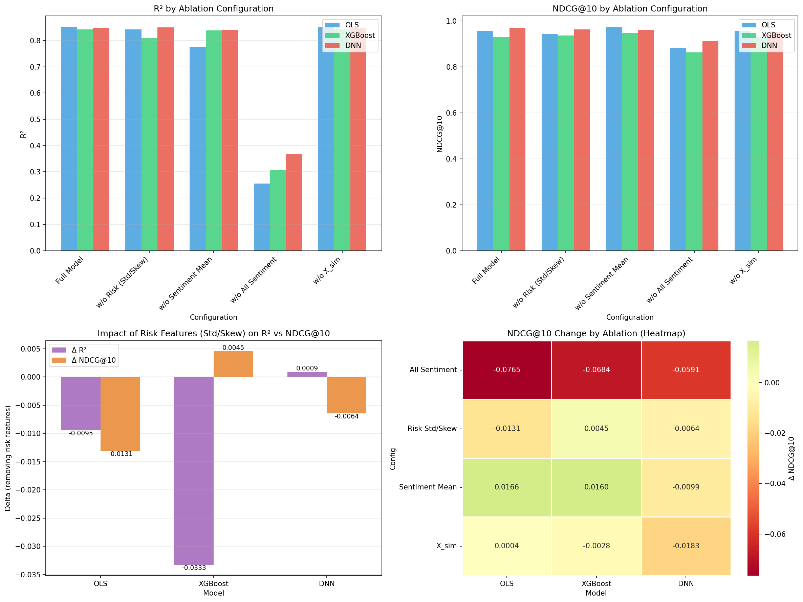

# Content-Based Restaurant Recommender: SBERT,XGBoost & MMR Pipeline     

**A Data-Centric AI Approach** to content-based recommendation with semantic understanding and diversity-aware re-ranking, achieving **R²=0.853** and **NDCG@10=0.961** on 10,841 restaurants with 2.39M reviews. This pattern mirrors **financial risk modeling** where investors penalize variance and negative skewness.

[](https://python.org)
[](https://tensorflow.org)
[](LICENSE)

---
⚠️ **Important: Task Scope Clarification**

**Why NDCG = 0.974?**  
Aggregated sentiment (X_sent_mean) correlates r=0.90 with aggregated star ratings because both measure customer satisfaction. This is the intended design for cold-start scenarios, not data leakage.

---

## Key Results
### DNNs Learn Risk-Aware Ranking from Distributional Sentiment

This project demonstrate that **providing distributional sentiment features (mean, std, skewness) enables neural networks to learn nonlinear quality patterns** that improve ranking (NDCG) without improving point prediction (R²).

#### Feature Importance Analysis (Normalized to X_sent_mean = 1.0)

The DNN learns that users prefer "safe" restaurants with consistent, positively-skewed review distributions. High variance indicates inconsistent experiences; negative skewness reveals hidden problems through occasional very negative reviews. 



---

## Repository Structure
**Note:** Core feature engineering and NLP pipelines (03–06) have been intentionally redacted from this public release to protect proprietary methods. The remaining scripts demonstrate the data ingestion, model training, and evaluation infrastructure.

```
restaurant-recommender/
├── src/                        # Pipeline scripts (01-09)
│   ├── config.py               # Central configuration (Not included)
│   ├── 01_yelp_etl.py          # Data extraction 
│   ├── 02_spatial_etl.py       # Spatial clustering 
│   ├── 03_sentiment.py         # [Redacted] Hybrid VADER + Transformer pipeline
│   ├── 04_sbert.py             # [Redacted] Hierarchical SBERT Chunking implementation
│   ├── 05_similarity_pop.py    # [Redacted] Semantic similarity matrix computation
│   ├── 06_feature_builder.py   # [Redacted] Final feature vector assembly (36-dim)
│   ├── 07_model_training.py    # Model training
│   ├── 08_ablation.py          # Ablation study
│   └── 09_mmr.py               # MMR evaluation
│
├── data/processed/             # Feature datasets
│   ├── features_all.parquet
│   └── restaurant_embeddings.parquet
│
├── models/                     # Trained checkpoints
│   ├── ols_model.joblib
│   ├── xgb_model.joblib
│   ├── dnn_model.keras
│   └── scaler.joblib
│
├── figures/                    # Visualizations
│
├── requirements.txt
├── run_models.py               # Quick-start (Local)
└── run_Models.ipynb            # Quick-start (Colab)
```

---

## Quick Start

### Option 1: Run with Pre-processed Data 

```bash
# Clone repository
git clone https://github.com/YourUsername/restaurant-recommender.git
cd restaurant-recommender

# Create virtual environment
python -m venv venv
source venv/bin/activate  # Windows: venv\Scripts\activate

# Install dependencies
pip install -r requirements.txt

# Run model training & evaluation
python run_models.py
```

### Option 2: Google Colab (Recommended)

[](https://colab.research.google.com/github/YourUsername/restaurant-recommender/blob/main/run_Models.ipynb)

```python
from google.colab import drive
drive.mount('/content/drive')
%cd /content/drive/MyDrive/capstone
!pip install -q xgboost sentence-transformers vaderSentiment
!python run_models.py
```
**Note:** This project was developed and tested using **Google Colab** with the following configuration:

- **Runtime type:** Python 3  
- **Hardware accelerator:** NVIDIA T4 GPU  
- **RAM:** High-RAM runtime  
- **Runtime version:** Latest available at execution time
---

## Feature Engineering

### 36-Feature Summary

| Category | Features | Count | Description |
|----------|----------|-------|-------------|
| **Semantic** | X_sim | 1 | Cosine similarity (two-phase design) |
| **Sentiment** | X_sent_mean, X_sent_std, X_sent_skew | 3 | Three-moment distribution |
| **Popularity** | X_pop | 1 | log(review_count + 1) |
| **Amenities** | TakeOut, Delivery, OutdoorSeating, etc. | 8 | Binary attributes |
| **Cuisine** | American, Mexican, Italian, etc. | 22 | One-hot encoded |
| **Spatial** | neighborhood_type | 1 | K-Means cluster |
| **Total** | | **36** | |

---

## Dataset

| Metric | Value |
|--------|-------|
| **Total Restaurants** | 10,841 |
| **Total Reviews** | 2,390,705 |
| **Geographic Coverage** | PA, FL, TN, AZ, LA |
| **Minimum Reviews** | 50 per restaurant |
| **Train / Val / Test Split** | 70% / 15% / 15% |
| **Test Set Size** | n = 1,627 |
| **Reviews > 512 tokens** | 78,043 (2.6%) |

**Source**: [Yelp Open Dataset](https://www.yelp.com/dataset) (2024)

---

## Requirements

```
# --- Core Data Science ---
numpy==1.26.4
pandas==2.2.3
scipy==1.14.1

# --- Machine Learning ---
scikit-learn==1.5.2
xgboost==2.1.1

# --- Deep Learning ---
# For standard systems:
tensorflow>=2.16.0
# For Apple Silicon, replace with:
# tensorflow-macos==2.16.2
# tensorflow-metal==1.2.0

# --- NLP ---
nltk==3.9.1
vaderSentiment==3.3.2
sentence-transformers==3.0.1
transformers==4.45.2
torch>=2.0.0

# --- Visualization ---
matplotlib==3.9.2
seaborn==0.13.2

# --- Utilities ---
tqdm==4.66.5
joblib>=1.3.0
pyarrow>=14.0.0
```

<details>
<summary>Apple Silicon (M1/M2/M3) Installation</summary>

```bash
pip install tensorflow-macos tensorflow-metal
```
</details>

---

## References

| # | Citation |
|---|----------|
| [1] | Hutto & Gilbert (2014). "VADER: A parsimonious rule-based model for sentiment analysis." *ICWSM* |
| [2] | Reimers & Gurevych (2019). "Sentence-BERT: Sentence embeddings using siamese BERT-networks." *EMNLP* |
| [3] | Chen & Guestrin (2016). "XGBoost: A scalable tree boosting system." *KDD* |
| [4] | Abadi et al. (2016). "TensorFlow: A system for large-scale machine learning." *OSDI* |
| [5] | Carbonell & Goldstein (1998). "MMR diversity-based reranking." *SIGIR* |
| [6] | Liu (2009). "Learning to rank for information retrieval." *FnTIR* |
| [7] | Yelp Open Dataset (2024). https://www.yelp.com/dataset |
| [8] | Ng (2021). "Data-Centric AI." DeepLearning.AI |

---

## Acknowledgments

### AI Tool Usage Disclosure

The author acknowledges the use of AI-assisted tools during development:

- **Claude (Anthropic)** and **Gemini (Google)**: Used for code debugging, structural suggestions, and accuracy verification
- All AI-generated suggestions were reviewed, validated, and modified by the author
- The research design, methodology, analysis, and conclusions represent the original work of the author

This usage complies with academic integrity policies regarding AI tools as assistive technology.

### Additional Acknowledgments

- Yelp for providing the Open Dataset
- Sentence-Transformers team for the SBERT implementation
- NVIDIA for CUDA/GPU acceleration support

---

## 📄 License

License - see [LICENSE](LICENSE) for details.
Copyright © 2025 Ying Wanapagron. All Rights Reserved.
